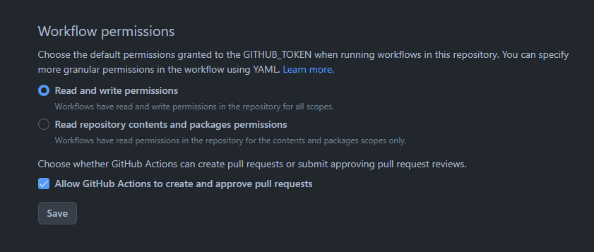

# 🎉 Github Actions

GitHub Actions: Automate your workflow! Build, test, and deploy code directly from your GitHub repository. Effortless CI/CD for developers.


### 🚀 Setup



> [WEATHER_API_KEY](https://www.weatherapi.com/) in Your repo > settings > Secrets and variables > Actions > New repository secret

### ✅ Blog Post `blog-post.yaml` with schedule every day: [source](https://github.com/gautamkrishnar/blog-post-workflow)

<!-- BLOG:START -->
<!-- BLOG:END -->

- Fix Backstage Error: Could not Fetch Catalog Entities
- How to Enable Ransomware Protection on Windows 11
- How to Trust Sign Image on Docker
- How to Rename all Files in Folder use UUID with Power Automate Desktop
- How to use Web Application Firewall (WAF) with Waf2Py

### ✅ Setup Poetry `setup-poetry.yaml` with on push: [source](https://github.com/abatilo/actions-poetry)

- Use command generate poetry virtualenv in project

```
poetry config virtualenvs.create true --local
poetry config virtualenvs.in-project true --local
```

- Show in file `poetry.toml`

```
[virtualenvs]
create = true
in-project = true
```

### ✅ Create Tag `create-tag.yaml` with on push: [source](https://github.com/mathieudutour/github-tag-action)

| Commit Message                                                        | Release Type  |
|-----------------------------------------------------------------------|---------------|
| fix(pencil): stop graphite breaking when too much pressure applied    | Patch Release |
| feat(pencil): add 'graphiteWidth' option                              | Minor Release |
| perf(pencil): remove graphiteWidth option                             | Major Release |

### ✅ Update Weather `update-weather.yml` with on push: [source](https://github.com/huantt/weather-forecast)


<table>
    <tr>
        <th>Date</th>
        <td>26/10/2023</td><td>27/10/2023</td><td>28/10/2023</td>
    </tr>
    <tr>
        <th>Weather</th>
        <td></td><td></td><td></td>
    </tr>
    <tr>
        <th>Condition</th>
        <td width="200px">Moderate rain</td><td width="200px">Patchy rain possible</td><td width="200px">Patchy rain possible</td>
    </tr>
    <tr>
        <th>Temperature</th>
        <td>25.4 -  31.7 °C</td><td>26.4 -  32.3 °C</td><td>26.7 -  31.9 °C</td>
    </tr>
    <tr>
        <th>Wind</th>
        <td>12.2 kph</td><td>14 kph</td><td>11.9 kph</td>
    </tr>
</table>
